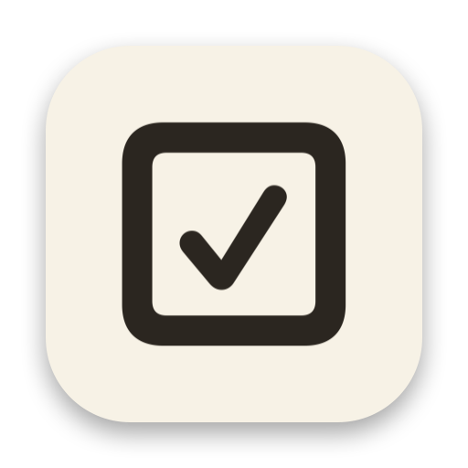

<p align="center">
  
</p>

<h1 align="center">MenuTodo</h1>

MenuTodo is a tiny todo list that lives in your menu bar. No Dock icon, no window to hunt for, just a checklist icon up top that shows how many things you still have to do.

Type into the box and hit Return to add something. Click the checkbox to tick it off. Hover a row and a grip handle shows up on the right, drag it to move the row somewhere else. The title at the top is editable too; click it and rename the list to whatever you're working on. Hover the popover itself and a footer slides in with how many items are left, a button to clear the done ones, and a small menu for launch at login and quitting.

Everything is saved as JSON in `~/Library/Application Support/MenuTodo/todos.json`.

## Download

Get the latest signed and notarized build from [Releases](https://github.com/HugoPrinsloo/MenuTodo/releases/latest).

## Build from source

```
brew install xcodegen
xcodegen generate
open MenuTodo.xcodeproj
```

Or just run `./build.sh`, which does the same and drops a built app in `build/`.

## License

MIT. See [LICENSE](LICENSE).
